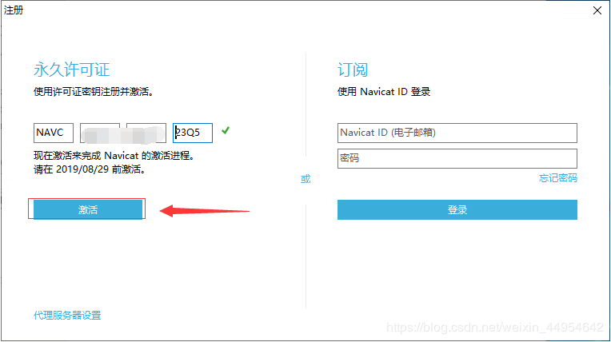
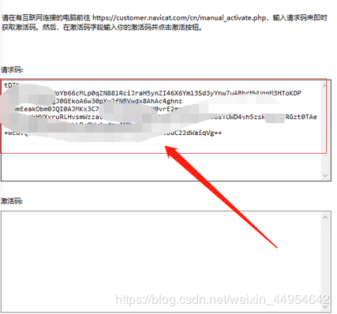
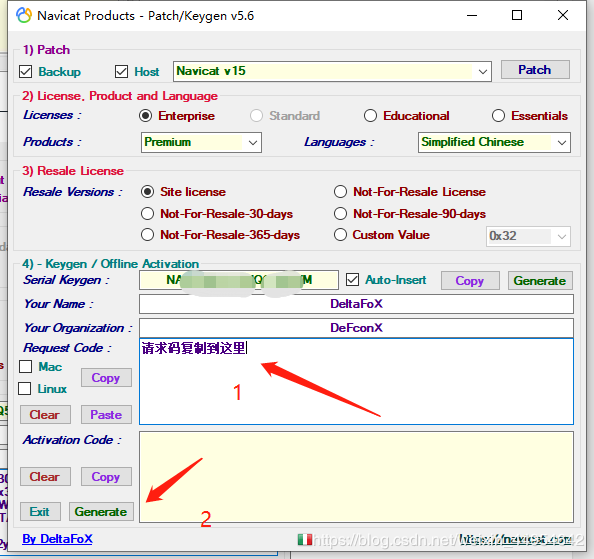

# [Navicat15 Crack](https://www.cnblogs.com/hfxtest/p/12513210.html)

1.  [官网下载 Navicat Premium](https://www.navicat.com.cn/)

2.  [网盘链接](https://pan.baidu.com/s/1ncSaxId2miL2s5hV8u_hSw)

    -   提取码：atpa（安装包和破解包都有）

3.  激活 Navicat Premium

    -   先把 Navicat 安装好

    -   然后把破解工具 Navicat_Keygen_Patch 解压， 以管理员身份运行

        

4.  点击 patch 弹出窗口，找到 navicat 下载的目录选择 navicat，点击打开

    

5.  显示为下图就是破解成功了

    1.  
    2.  点击 Generate
    3.  出现序列码
    4.  点击 Copy

6.  然后打开 navicat
    

7.  第一次打开会提示注册和试用，由于作者是破解过了，我就不截图了，你们第一次打开的时候点击注册，然后把刚才copy的序列码复制进去，点击激活
    

8.  选择手动激活
    

9.  然后会生成一大串请求码
    

10.  复制请求码到注册机中的Request Code中，点击Activation Code下的generate，生成激活码!

    1.  
    2.  
    3.  

11.  点击激活，然后再次打开就可以啦，破解成功
